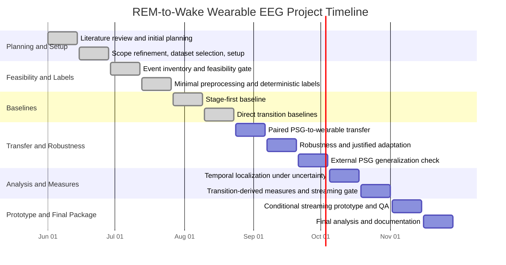
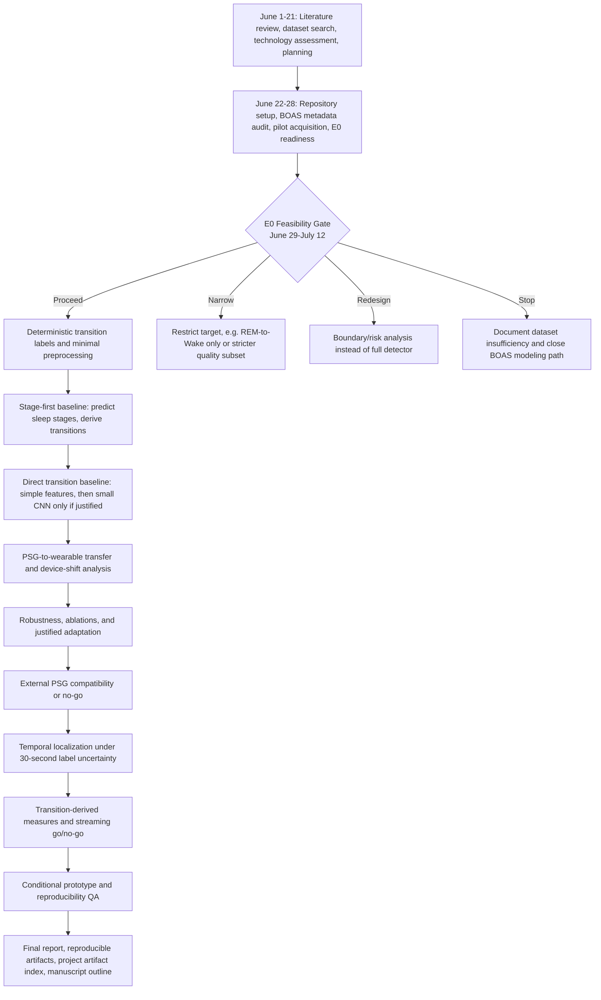

# Overall Project Timeline

**Project:** REM-to-Wake transition-boundary detection from wearable EEG
**Project window:** 2026-06-01 to 2026-11-29
**Prepared during:** 2026-06-25 to 2026-06-28
**Finalized:** 2026-06-28
**Current status:** Blocks 3-7 are complete; Block 5 was completed as catch-up work on 2026-08-15 after an inactive 2026-07-20 to 2026-08-14 interval; Block 6 closed on 2026-08-22 with direct DE-B improving on transparent stage-first SF-C while retaining low precision; validation-only endpoint factorization DE-D subsequently improved both validation F1 and false alarms but remains unevaluated on a new locked cohort; Block 7 closed on 2026-09-06 after the frozen descriptive test showed six-channel PSG leading, a validation-to-test channel-order reversal, and a persistent zero-shot/direct-wearable F1-versus-false-alarm tradeoff; Block 8 robustness work begins next

## 1. Project Boundary

This project is not a general sleep-stage classification project. Sleep stages are used as source annotations and as a later comparator. The direct project target is event-specific REM-to-Wake boundary detection from wearable EEG, with explicit handling of 30-second label uncertainty.

The project should not train models until the feasibility gate confirms that BOAS has enough usable events and participant-level spread to justify modeling.

## 2. Full Timeline

## 3. End-to-End Flow

## 4. Phase Table

| Block | Dates | Main Question | Main Work | Deliverable | Status as of 2026-09-06 |
|---:|---|---|---|---|---|
| 1 | Jun 1-Jun 14 | What is known and what is uncertain? | Literature review, initial planning, public-dataset search | Initial proposal, literature evidence, dataset candidate list | Complete |
| 2 | Jun 15-Jun 28 | Can the project be set up cleanly with a defensible dataset and target? | Scope refinement, BOAS selection, repository setup, environment audit, pilot checks, E0 readiness | Revised proposal, manifest, setup records, pilot reports, E0 readiness package | Complete |
| 3 | Jun 29-Jul 12 | Are there enough usable REM/Wake events to justify modeling? | Full event inventory, participant grouping, label-quality audit, feasibility decision | E0 feasibility report and proceed/narrow/redesign/stop decision | Count-level inventory, proceed decision, full EDF acquisition, full signal-alignment validation, label artifact v0.1, background-window rules, quality flags, and split-readiness review complete |
| 4 | Jul 13-Jul 26 | Can labels and minimal preprocessing be made reproducible? | Transition-event table, uncertainty intervals, alignment validation | Versioned label table and preprocessing artifacts | Complete; membership v0.1 separates conservative primary and expanded quality-sensitivity tiers; gate passed 2026-07-18 |
| 5 | Jul 27-Aug 9 | What does a stage-first comparator achieve? | Wearable sleep-stage baseline, transition derivation from predicted stages | Stage-first event metrics | Completed as catch-up work on Aug 15; fixed `stage_ai`, epoch-only logistic, and five-epoch-context logistic comparators evaluated under frozen event matching |
| 6 | Aug 10-Aug 23 | Does direct transition detection add value? | Simple direct baseline, small CNN only if justified, comparison to stage-first | Comparative baseline report | Complete Aug 22; DE-B improved test event F1 and false alarms/hour versus SF-C but retained precision 0.0909; validation-only DE-D improved F1 to 0.1604 and false alarms to 0.9915/hour versus DE-B validation; CNN deferred and DE-D test evaluation withheld |
| 7 | Aug 24-Sep 6 | How large is the PSG-to-wearable device-shift problem? | Common six-channel PSG EEG, reduced PSG, wearable, strict zero-shot, and conditionally gated feature alignment | Paired transfer results and decision log | Complete Sep 6; `P2-D` led validation, `P6-D` led the descriptive test, strict zero-shot remained below direct wearable F1 with fewer false alarms, and alignment was skipped by the frozen gate |
| 8 | Sep 7-Sep 20 | Is the approach robust to signal/channel variability? | Missing-channel tests, degradation tests, ablations, justified adaptation if needed | Robustness and ablation report | Not started; Block 7 transfer comparison must be completed before this work begins |
| 9 | Sep 21-Oct 4 | Is external PSG comparison scientifically valid? | Audit one external PSG dataset and test reduced-channel generalization if appropriate | External generalization report or no-go | Not started |
| 10 | Oct 5-Oct 18 | How should 30-second label uncertainty be handled? | Hard-label versus interval-aware temporal analysis | Label-uncertainty and localization report | Not started |
| 11 | Oct 19-Nov 1 | Are transition-derived measures stable enough to report? | Event burden, REM stability, repeated-night reliability, streaming decision | Technical measures and streaming go/no-go | Not started |
| 12 | Nov 2-Nov 15 | Is a streaming demonstration justified and reproducible? | Conditional command-line prototype, latency/memory check, clean rerun, QA | Prototype or no-go plus reproducibility report | Not started |
| 13 | Nov 16-Nov 29 | What is the final defensible package? | Freeze reviewed results, final report, artifact index, manuscript outline | Final technical report and reproducible project package | Not started |

## 5. Gate Logic

| Gate | Target Date | Decision | Required Evidence |
|---|---|---|---|
| E0 feasibility gate | 2026-07-12 | Proceed, narrow, redesign, or stop | Event counts by recording and `pid`, label-quality flags, unlabeled-tail summary, participant spread |
| Label/preprocessing gate | 2026-07-26 | Passed 2026-07-18; freeze v0.1/v0.3 inputs | Tested label generation, alignment checks, quality flags, participant split, preprocessing checks, analysis membership |
| Baseline gate | 2026-08-23 | Passed 2026-08-22: continue direct-event research with limitations; retain simple baseline and defer CNN | Stage-first versus direct event-level comparison, paired participant uncertainty, residual failure analysis |
| Transfer/robustness gate | 2026-09-20 | Add adaptation or keep simpler model | PSG-to-wearable transfer result and robustness evidence |
| External-data gate | 2026-10-04 | External test or documented no-go | Compatibility audit and clear label/channel mapping |
| Streaming gate | 2026-11-01 | Prototype or no-go | Offline evidence, threshold sensitivity, repeated-night reliability if possible |
| Final QA gate | 2026-11-15 | Freeze prototype/results or no-go | Clean rerun, split/seed/config verification, artifact linkage |

## 6. Current Completed Evidence

Completed before or by 2026-06-28:

- preliminary literature review, dataset search, technology assessment, and planning records for June 1-21;
- revised project proposal and working rules;
- BOAS metadata manifest and version correction to OpenNeuro snapshot `1.1.1`;
- repository setup and GitHub remote configuration;
- environment audit confirming existing `SMRI` environment can read EDF files with `mne` and `edfio`;
- limited `sub-53` pilot acquisition outside Git;
- EDF header verification for paired PSG/headband files;
- pilot REM/Wake transition candidates from PSG `stage_hum`;
- transition-window quality check around six `sub-53` candidates;
- transition-label specification `v0.1`;
- E0 feasibility audit protocol and metadata data dictionary;
- all-recording BOAS metadata/event readiness check without EDF download.

Additional evidence completed on 2026-07-01:

- all-recording E0 transition inventory across 128 PSG `stage_hum` event files;
- 365 direct REM-to-Wake candidates across 112 recordings and 88 unique `pid` values;
- 111 Wake-to-REM secondary candidates across 57 recordings and 46 unique `pid` values;
- label-quality audit confirming no missing `stage_hum` values, no non-30-second epochs, and no sidecar duration or sampling-frequency mismatch;
- E0 proceed decision for deterministic label-table generation and minimal preprocessing, with model training still blocked.

Additional evidence completed on 2026-07-04:

- `sub-53` PSG-to-headband signal-level alignment pilot using the already downloaded paired EDF files;
- sample-index validation showing all six `sub-53` REM/Wake transition windows use matching PSG/headband extraction indices;
- pulse-based drift proxy using `HB_PULSE` versus `PSG_PULSE`, with four usable windows and all usable lags within +/-2 seconds;
- EEG-envelope artifact/physiology proxy showing `HB_1` versus `PSG_F3` peaked within +/-1 second for all six transition windows;
- decision to treat `sub-53` as sample-aligned for pilot label-table and minimal preprocessing work, without generalizing this result to all BOAS recordings;
- full BOAS EDF acquisition outside Git: 256 EDF files, 35,913,652,480 bytes, with no partial files and no size mismatches against remote object sizes;
- full-dataset signal-alignment validation across 128 paired PSG/headband EDF recordings;
- timeline validation showing all 128 EDF pairs matched on start time, sampling rate, sample count, and duration;
- transition-window sample-index validation showing all 476 E0 REM/Wake candidate windows used matching PSG/headband sample indices;
- pulse and EEG-envelope proxy analyses recorded as supporting evidence, not as ground-truth synchronization markers;
- decision to proceed to versioned deterministic label-table generation and minimal preprocessing, with model training still blocked.
- transition-label artifact `v0.1` with 476 REM/Wake rows: 365 primary REM-to-Wake labels and 111 secondary Wake-to-REM labels;
- each label preserves nominal boundary time, +/-15 second uncertainty interval, PSG/headband sample indices, label source, and quality flags;
- participant-level label distribution and grouped split-policy draft added for later leakage-safe splitting by `pid`, without assigning final splits yet.

Additional evidence completed on 2026-07-09:

- background-window specification `v0.1` added to prevent negative-window contamination around REM/Wake boundary uncertainty intervals;
- 119,967 possible adjacent-epoch background centers checked;
- 115,275 eligible background centers found after edge, disconnection, REM/Wake-boundary, and uncertainty-overlap exclusions;
- deterministic background review artifact written with 4,302 rows, without treating it as a final training set;
- signal-quality flags `v0.1` added for 128 recordings, 476 transition windows, and 4,302 background review windows;
- current critical quality checks include all reviewed recordings/windows for preprocessing while preserving pulse and EEG-envelope proxy notes;
- split-readiness review `v0.1` added by `pid`, showing 88 `pid` values with both primary REM-to-Wake labels and background review windows;
- final train/validation/test split still not assigned.

Additional evidence completed on 2026-07-11:

- predeclared full headband window signal-quality protocol applied to 9,556 `HB_1`/`HB_2` channel-window measurements;
- 15 transition windows and 20 background review windows met critical constant, near-flat, or flatline exclusion rules;
- 350 of 365 primary REM-to-Wake events remain after critical screening, with all 88 contributing `pid` groups retained;
- critical failures identified as participant-concentrated, including 16 windows in `pid 89`, five in `pid 77`, and five in `pid 91`;
- the 10-MAD review rule found to be nonspecific for raw EEG after flagging 2,663 channel-window measurements across all participant groups;
- nonspecific 10-MAD flags preserved for sensitivity analysis, while 381 windows with targeted amplitude, jump, or endpoint flags receive review priority;
- final E0 decision remains `proceed` to Block 4, with model training still blocked.

Additional evidence completed on 2026-07-15:

- integrated structural and full headband amplitude evidence into signal-quality artifact v0.2;
- retained four explicit outcomes: clean include, 10-MAD sensitivity include, targeted review, and critical exclusion;
- confirmed 350 primary REM-to-Wake windows remain across 88 `pid` groups after 15 critical exclusions;
- predeclared deterministic grouped split rules using participant metadata and pre-model label/quality counts only;
- evaluated 50,000 assignments using seed `20260715` and froze a 64/16/20 `pid` train/validation/test split;
- obtained 229/51/70 retained primary events and 56/14/18 primary-positive `pid` values in train/validation/test;
- verified that no repeated participant crosses partitions and locked the test partition before preprocessing or model work.
- preprocessing v0.1 passed 82/82 recording and 3/3 synthetic checks but failed two of 3,065 retained train windows because 240-second coverage was incomplete;
- identified the insufficient earlier rule: equal PSG/headband lengths did not guarantee the required absolute window length;
- added quality v0.3 with an exact 61,440-sample rule, identifying eight incomplete primary windows, including two new critical exclusions;
- retained 348 primary REM-to-Wake events across all 88 contributing `pid` groups and kept the frozen participant assignment unchanged;
- preprocessing v0.2 passed 82/82 train recordings, 3,063/3,063 retained train windows, and 3/3 synthetic checks without reading validation/test signals.

Additional evidence completed on 2026-07-18:

- predeclared deterministic treatment of targeted-review flags without opening raw signal files;
- rejected unrestricted primary inclusion because unresolved artifact indicators would be ignored, and rejected total removal because targeted thresholds are not validated failure labels;
- froze quality analysis membership v0.1 with clean and 10-MAD-only rows in the primary tier, targeted rows in an expanded sensitivity tier, and critical rows excluded from both;
- preserved all 476 transition and 4,302 background review rows with complete partition assignment and zero participant leakage;
- obtained 276 primary-tier REM-to-Wake events across 72 `pid` groups and 348 expanded-tier events across 88 groups;
- identified 16 `pid` groups represented only by targeted-review primary events, distributed 9/4/3 across train/validation/test;
- passed the label/preprocessing gate with transition labels v0.1, background rules v0.1, quality v0.3, membership v0.1, split v0.1, and preprocessing v0.2 frozen;
- retained the primary validation limitation of 37 events across 10 positive groups for later uncertainty reporting;
- completed a cross-artifact integrity audit with 71/71 checks passed, exact linkage of 3,063 noncritical train windows and 82 train recordings, zero validation/test preprocessing rows, and an LF-normalized SHA-256 manifest covering 19 frozen files.

Additional evidence completed on 2026-08-15:

- recorded that no project work is attributed to the inactive 2026-07-20 to 2026-08-14 interval and completed the overdue Block 5 work on its actual date;
- froze a stage-first protocol before inspecting model results, including three comparators, participant-grouped partitions, primary and expanded quality membership, +/-15-second and +/-45-second tolerances, and participant-cluster bootstrap intervals;
- validated the one-to-one event matcher on 10 synthetic cases covering tolerance edges, duplicate predictions, ignore zones, tie-breaking, empty inputs, and recording isolation;
- evaluated fixed BOAS headband `stage_ai` as a provenance-limited descriptive comparator, obtaining test stage macro F1 0.7248 and primary event F1 0.3731 at +/-15 seconds;
- fitted transparent epoch-only and five-epoch-context logistic baselines using two-channel Welch log-bandpower features and train-only scaling;
- preserved the SF-C convergence warning at the frozen 500-iteration limit instead of silently changing the configuration;
- wrote the validation decision before opening test signals, confirmed zero cached test features, and then performed one frozen test evaluation;
- obtained SF-C test stage macro F1 0.4979 but primary event F1 0.0766, precision 0.0438, recall 0.3051, and 1.9692 false alarms/hour at +/-15 seconds;
- confirmed that context improved both validation and test metrics over the epoch-only ablation, while neither transparent stage-derived detector approached a usable event alarm rate;
- passed output-integrity checks for participant isolation, phase separation, exact metric recomputation, event accounting, and SHA-256 verification of 130 external model/feature artifacts;
- completed an exploratory failure analysis using frozen tables only, with 18 input files recorded by SHA-256 and no raw-signal, external-feature, or model access;
- found that SF-C correctly retained the preceding REM endpoint at only 22 of 59 primary test references, compared with 46 of 59 correct following Wake endpoints;
- found that all 20 test participants produced false positives and that 306 of 393 false positives occurred at human REM-to-other or other-to-Wake pairs;
- measured a 2.1784-fold excess in SF-C test all-stage transition rate, 799 predicted versus 156 human REM bouts, and median REM-bout durations of 60 versus 600 seconds, supporting sequence fragmentation as the stage-first failure mechanism;
- completed a participant-paired context diagnostic using 11 hashed frozen input tables and no raw-signal, external-feature, or model access;
- preserved and corrected an initial participant balanced-accuracy warning caused by participant-dependent missing-stage denominators before interpreting the diagnostic;
- found SF-C stage macro F1 improved for all 20 test participants, while event F1 improved for 10 and remained unchanged for 10;
- obtained an exploratory paired-bootstrap SF-C minus SF-B test event-F1 difference of +0.0431 with a 95% interval of +0.0199 to +0.0676, while the false-alarm-rate difference interval crossed zero;
- found that six of seven additional SF-C test matches admitted at +/-45 seconds were one epoch early and that 59.20% of predicted REM bouts lasted only 30 or 60 seconds, compared with 14.10% of human bouts;
- observed a descriptive test-recording Spearman association of 0.5118 between predicted REM bouts/hour and false alarms/hour, recorded as exploratory and noncausal.

Additional evidence completed on 2026-08-22:

- predeclared a direct-event protocol before fitting, including two logistic baselines, all primary reviewed background rows, full-night candidate scoring, contiguous-run alarm consolidation, 99 fixed validation thresholds, and a hash-locked test phase;
- fitted DE-A with two boundary epochs and DE-B with eight epochs using 180 train REM-to-Wake events and 2,563 train backgrounds, with zero context drops and zero convergence warnings;
- retained the negative validation context result: DE-B increased recall but had event F1 0.1127 versus 0.1152 for DE-A and increased false alarms from 0.8909 to 1.4496 per hour;
- froze DE-A threshold 0.97 and DE-B threshold 0.96 before direct-model test-feature access, then retained the one-time fixed test evaluation without refitting;
- obtained DE-B test event precision 0.0909, recall 0.4237, F1 0.1497, and 1.2571 false alarms per hour, compared with SF-C F1 0.0766 and 1.9692 false alarms per hour;
- obtained a paired participant-bootstrap DE-B minus SF-C event-F1 difference of +0.0731 with a 95% interval of +0.0110 to +0.1659 and a false-alarm-rate difference of -0.7121 per hour with a 95% interval of -1.2709 to -0.2044;
- retained SF-A as a provenance-limited descriptive comparator with substantially higher F1 0.3731 and lower false alarms 0.2609 per hour, preventing a claim that the new direct baseline is the best available headband result;
- passed 22/22 direct-output integrity checks covering phase isolation, threshold selection, model and feature hashes, alarm recomputation, support accounting, and exact event-metric recomputation;
- completed a post-result exploratory failure analysis without raw EDF or model access and passed 9/9 diagnostic integrity checks;
- found 65.6% of DE-B false positives at partial target endpoints: 108 human other-to-Wake and 56 human REM-to-other pairs;
- found only 6.8% of false positives within 135 seconds of a REM/Wake boundary, arguing against the excluded boundary zone as the dominant error source;
- found false positives in 18 of 20 test participants, with the top four contributing 58.8%, and eight additional +/-45-second matches consisting of two early and six late one-epoch displacements;
- closed the baseline gate by continuing the direct-event research direction while deferring a CNN until a new protocol can isolate a representation-specific uncertainty and avoid revising the frozen test result.
- audited partial-endpoint coverage before an improvement experiment and found 466 REM-to-other plus 546 other-to-Wake primary train backgrounds, each spanning all 64 train `pid` groups, rejecting simple absence of hard negatives as the explanation;
- predeclared a sequential validation-only DE-D experiment with separate REM-before and Wake-after logistic heads, the same 80 context features, a fixed product conjunction, and no current-test access;
- fitted both endpoint heads on the same 2,743 train rows without convergence warnings and selected threshold 0.74 using the unchanged 99-threshold validation rule;
- obtained DE-D validation precision 0.0971, recall 0.4595, F1 0.1604, and 0.9915 false alarms per hour, versus DE-B validation F1 0.1127 and 1.4496 false alarms per hour, meeting the predeclared two-part improvement rule;
- reduced validation partial-endpoint false positives from 151 for DE-B to 110 for DE-D and passed 19/19 factorization integrity checks with no test artifact or row;
- found through a post-result paired analysis that false positives decreased for 11 of 16 validation participants and increased for four;
- obtained a paired validation participant-bootstrap DE-D minus DE-B F1 interval of +0.0038 to +0.1008 and false-alarm-rate interval of -0.8835 to -0.1423 per hour, with 6/6 analysis integrity checks passed;
- retained DE-D only as a candidate for a future new locked or external evaluation and left the frozen DE-B test result unchanged.
- predeclared threshold perturbation and leave-one-participant-out calibration analyses using saved validation scores only, without model, feature, train-row, or test access;
- found the DE-D two-part advantage over DE-B held across 22 adjacent thresholds from 0.67 through 0.88;
- found all 16 leave-one-participant-out calibration folds independently selected threshold 0.74, reproducing validation F1 0.1604 and 0.9915 false alarms per hour on aggregated held-out participants;
- passed 13/13 threshold-robustness checks after preserving and correcting an initial validator failure caused by bitwise float comparison after TSV serialization.
- predeclared a post-result endpoint-contribution diagnostic using saved validation probabilities only, with no model fit or current-test access;
- found REM-only F1 0.0613 with 1.3554 false alarms per hour and Wake-only F1 0.0609 with 4.7629 false alarms per hour, compared with product F1 0.1604 and 0.9915 false alarms per hour;
- observed the expected partial-endpoint pattern: 73 REM-to-other false alarms for REM-only versus 35 for the product and 464 other-to-Wake false alarms for Wake-only versus 75 for the product;
- passed 7/7 in-run and 11/11 independent endpoint-contribution checks across 26 hashed inputs, while retaining the result as validation-only mechanism evidence.

Additional evidence completed on 2026-08-23:

- completed an end-to-end repository audit without changing any frozen model metric or decision;
- resolved all 33 unique DOI references in project Markdown to structured metadata with matching identifiers;
- verified all 256 local EDF files, totaling 35,913,652,480 bytes, against the official OpenNeuro `1.1.1` git-annex sizes and SHA-256 values;
- explicitly quantified across-night pulse-lag change for 82 recordings with at least three usable windows;
- found median projected lag change 0.1250 seconds and 95th percentile absolute projected change 1.4781 seconds;
- retained `sub-32`, `sub-39`, and `sub-50` as review cases after they exceeded the retrospective 2-second projected-change screen, without treating the pulse proxy as direct clock drift;
- documented that the current test partition is no longer independently confirmatory and froze Block 7 entry conditions before its scheduled start;
- reconciled the repository artifact policy with the compact labeled-row probability tables retained for exact metric recomputation.

Additional evidence completed on 2026-08-25 to 2026-08-26:

- predeclared the Block 7 paired PSG-to-wearable protocol before feature extraction or fitting;
- fixed the same DE-B logistic context method across a common six-channel PSG EEG reference, reduced `F3/F4` PSG, and real `HB_1/HB_2` wearable EEG;
- predeclared strict zero-shot ordering, a validation-only gate for one robust feature-alignment method, and one frozen descriptive test opening;
- audited all 256 EDF headers and channel sidecars across 128 paired recordings;
- passed 128/128 checks for required files, header/sidecar channel agreement, M1 reference, 256 Hz sampling, equal paired duration, and fixed channel eligibility;
- identified seven PSG and three headband channel configurations caused by optional sensor variability;
- retained all 128 recordings by defining full PSG as the complete common six-channel EEG montage rather than mixing optional EOG, respiratory, pulse, oxygen-saturation, or motion inputs; and
- recorded that `F3/F4` to `HB_1/HB_2` transfer combines electrode-location and device effects rather than isolating hardware alone.

Additional evidence completed on 2026-08-31 and 2026-09-06:

- implemented the predeclared train-only feature gate on August 31 and executed it on September 6 without validation/test access or model fitting;
- processed 82 train recordings across 64 `pid` groups and passed all 164 PSG/headband signal-path checks;
- fitted six PSG and two wearable robust channel scalers from train signals only, reusing the PSG `F3/F4` parameters for the reduced PSG path;
- passed five fixed synthetic spectral checks and all 82 per-recording feature/context checks;
- obtained exact `PSG-6` versus `PSG-2` overlap parity and maximum wearable-reference feature difference `4.7662e-7`;
- stored 246 full feature arrays outside Git and retained their relative paths, sizes, and SHA-256 values;
- independently rehashed and reopened all 246 artifacts and passed 15/15 membership, partition, schema, timing, parity, and hash-linkage checks; and
- passed the feature-infrastructure gate while retaining transfer fitting and validation as overdue Block 7 carryover.
- fixed the remaining validation execution definitions before accessing validation features, including common temporal support, zero-shot PSG scaling, pooled-MAD gate arithmetic, and threshold inheritance;
- generated 82 train zero-shot arrays and 80 validation arrays outside Git, retaining 162 hashes and exact cross-modality timing parity;
- fitted `P6-D`, `P2-D`, and `H2-D` on the same 180 positive and 2,563 background train candidates without convergence warnings;
- selected validation thresholds 0.99, 0.99, and 0.96 respectively using the frozen event-level rule;
- obtained primary validation F1/false alarms per hour of 0.1631/1.1107 for `P6-D`, 0.1887/0.3702 for `P2-D`, and 0.1123/1.4558 for `H2-D`;
- obtained strict zero-shot `P2-H2-Z` validation F1 0.0685 and 0.6526 false alarms per hour using the unchanged `P2-D` model and threshold;
- found a paired zero-shot F1 loss of 0.1202 versus direct `P2-D`, with 95% interval 0.0336 to 0.2001, while the false-alarm difference interval crossed zero;
- opened the adaptation performance condition but closed the distribution condition because 11/80 dimensions exceeded the fixed 0.50 pooled-scale threshold, below the required 20%, and therefore skipped `P2-H2-A`;
- independently reproduced all model probabilities, 297 threshold rows, 655 alarms, event summaries, paired bootstraps, feature-shift values, and gate arithmetic in 23/23 checks without raw EDF or test access; and
- retained the one-time frozen descriptive test comparison as unfinished Block 7 carryover.
- completed the one-time frozen descriptive test comparison on 26 recordings from 20 `pid` groups without refitting or threshold revision;
- obtained primary test F1/false alarms per hour of 0.2048/0.4525 for `P6-D`, 0.1429/0.3570 for `P2-D`, 0.1493/1.2621 for `H2-D`, and 0.1067/0.4173 for `P2-H2-Z`;
- found a `P6-D - P2-D` test F1 difference of +0.0620 with paired 95% interval +0.0019 to +0.1194, reversing the validation point direction and establishing channel-effect instability across the used partitions;
- found the `P2-D - P2-H2-Z` test F1 difference remained positive at +0.0362 but its interval crossed zero, weakening the apparent stability of the validation transfer-loss magnitude;
- reproduced the zero-shot/direct-wearable tradeoff: zero-shot F1 was 0.0426 lower with an interval crossing zero, while false alarms were 0.8448/hour lower with interval -1.2441 to -0.5081;
- confirmed that the fixed exclusion of `sub-32` and `sub-50` retained `P6-D` as the highest-F1 comparator and did not rescue zero-shot transfer;
- passed 13/13 in-run and 13/13 independent checks, rehashed 108 external artifacts, and independently reconstructed 95,460 probabilities, all event outputs, and four paired contrasts twice; and
- closed Block 7 without revising any model or threshold, retaining the current test evidence as descriptive and requiring a new locked or external cohort for confirmation.

## 7. Next Work

Block 8 should begin with a separate frozen robustness protocol. It should test whether the direct wearable result and PSG channel-order reversal are sensitive to missing channels, controlled signal degradation, and participant concentration. It must use the existing frozen scores where sufficient, generate new corrupted-signal features only under a committed protocol, and keep the current test partition closed to model or threshold revision. No adaptation method is authorized merely because Block 7 performance is low; a method requires a specific failure mechanism and a separate hypothesis.

## 8. Rules for the Rest of the Project

- Keep raw data, model weights, binary feature arrays, and full-night score artifacts outside Git. Retain compact reviewed tabular outputs only when needed for exact result reconstruction.
- Preserve failed, negative, and inconclusive results.
- Keep weekly records contemporaneous.
- Push meaningful work at least weekly during active work periods.
- Do not train or evaluate models before the label/preprocessing gate.
- Do not use headband `stage_ai` as human ground truth.
- Do not claim clinical utility from BOAS alone.
- Before any model experiment, record the known-method baseline, hypothesis, configuration, metric, result, limitation, and next decision.
- Keep routine data setup separate from experiments that test a stated technical uncertainty.
