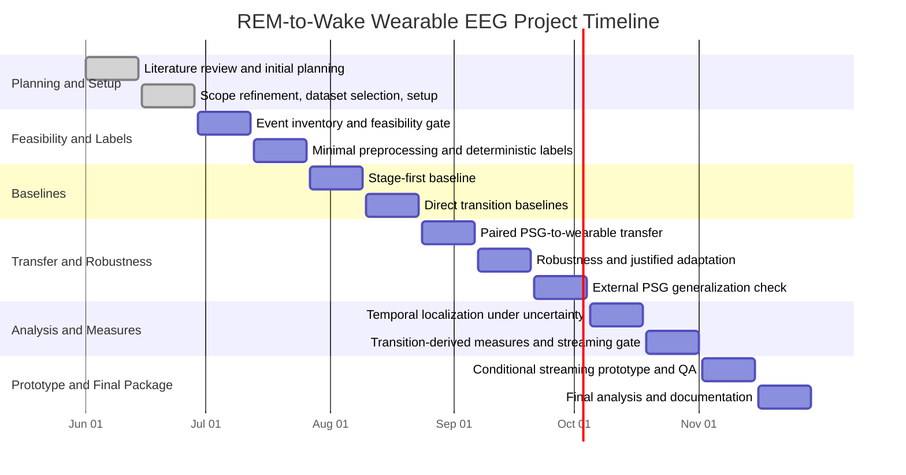
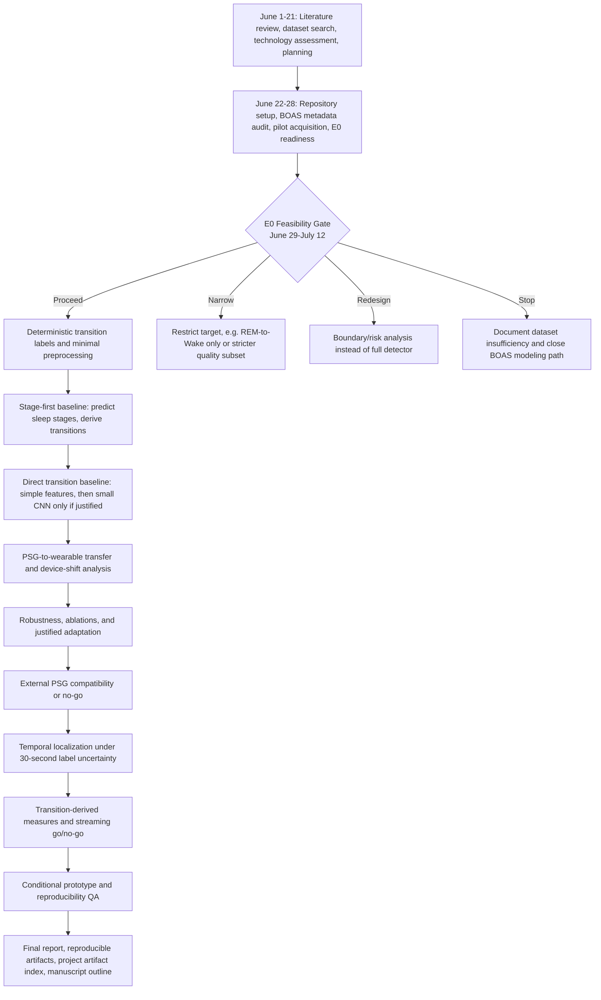

# Overall Project Timeline

**Project:** REM-to-Wake transition-boundary detection from wearable EEG
**Project window:** 2026-06-01 to 2026-11-29
**Prepared during:** 2026-06-25 to 2026-06-28
**Finalized:** 2026-06-28
**Current status:** Block 3 E0 count-level inventory, full EDF acquisition, full-dataset signal-alignment validation, and transition-label artifact v0.1 complete; proceed to background-window rules and signal-quality flags, with model training still blocked

## 1. Project Boundary

This project is not a general sleep-stage classification project. Sleep stages are used as source annotations and as a later comparator. The direct project target is event-specific REM-to-Wake boundary detection from wearable EEG, with explicit handling of 30-second label uncertainty.

The project should not train models until the feasibility gate confirms that BOAS has enough usable events and participant-level spread to justify modeling.

## 2. Full Timeline

## 3. End-to-End Flow

## 4. Phase Table

| Block | Dates | Main Question | Main Work | Deliverable | Status as of 2026-07-04 |
|---:|---|---|---|---|---|
| 1 | Jun 1-Jun 14 | What is known and what is uncertain? | Literature review, initial planning, public-dataset search | Initial proposal, literature evidence, dataset candidate list | Complete |
| 2 | Jun 15-Jun 28 | Can the project be set up cleanly with a defensible dataset and target? | Scope refinement, BOAS selection, repository setup, environment audit, pilot checks, E0 readiness | Revised proposal, manifest, setup records, pilot reports, E0 readiness package | Complete |
| 3 | Jun 29-Jul 12 | Are there enough usable REM/Wake events to justify modeling? | Full event inventory, participant grouping, label-quality audit, feasibility decision | E0 feasibility report and proceed/narrow/redesign/stop decision | Count-level inventory, proceed decision, full EDF acquisition, full signal-alignment validation, and label artifact v0.1 complete |
| 4 | Jul 13-Jul 26 | Can labels and minimal preprocessing be made reproducible? | Transition-event table, uncertainty intervals, alignment validation | Versioned label table and preprocessing artifacts | Next |
| 5 | Jul 27-Aug 9 | What does a stage-first comparator achieve? | Wearable sleep-stage baseline, transition derivation from predicted stages | Stage-first event metrics | Not started |
| 6 | Aug 10-Aug 23 | Does direct transition detection add value? | Simple direct baseline, small CNN only if justified, comparison to stage-first | Comparative baseline report | Not started |
| 7 | Aug 24-Sep 6 | How large is the PSG-to-wearable device-shift problem? | Full PSG, reduced PSG, wearable, zero-shot and fine-tuning tests | Paired transfer results and decision log | Not started |
| 8 | Sep 7-Sep 20 | Is the approach robust to signal/channel variability? | Missing-channel tests, degradation tests, ablations, justified adaptation if needed | Robustness and ablation report | Not started |
| 9 | Sep 21-Oct 4 | Is external PSG comparison scientifically valid? | Audit one external PSG dataset and test reduced-channel generalization if appropriate | External generalization report or no-go | Not started |
| 10 | Oct 5-Oct 18 | How should 30-second label uncertainty be handled? | Hard-label versus interval-aware temporal analysis | Label-uncertainty and localization report | Not started |
| 11 | Oct 19-Nov 1 | Are transition-derived measures stable enough to report? | Event burden, REM stability, repeated-night reliability, streaming decision | Technical measures and streaming go/no-go | Not started |
| 12 | Nov 2-Nov 15 | Is a streaming demonstration justified and reproducible? | Conditional command-line prototype, latency/memory check, clean rerun, QA | Prototype or no-go plus reproducibility report | Not started |
| 13 | Nov 16-Nov 29 | What is the final defensible package? | Freeze reviewed results, final report, artifact index, manuscript outline | Final technical report and reproducible project package | Not started |

## 5. Gate Logic

| Gate | Target Date | Decision | Required Evidence |
|---|---|---|---|
| E0 feasibility gate | 2026-07-12 | Proceed, narrow, redesign, or stop | Event counts by recording and `pid`, label-quality flags, unlabeled-tail summary, participant spread |
| Label/preprocessing gate | 2026-07-26 | Freeze label spec or revise | Tested label generation, alignment checks, quality flags |
| Baseline gate | 2026-08-23 | Continue direct detector, narrow, or revise | Stage-first versus direct event-level comparison |
| Transfer/robustness gate | 2026-09-20 | Add adaptation or keep simpler model | PSG-to-wearable transfer result and robustness evidence |
| External-data gate | 2026-10-04 | External test or documented no-go | Compatibility audit and clear label/channel mapping |
| Streaming gate | 2026-11-01 | Prototype or no-go | Offline evidence, threshold sensitivity, repeated-night reliability if possible |
| Final QA gate | 2026-11-15 | Freeze prototype/results or no-go | Clean rerun, split/seed/config verification, artifact linkage |

## 6. Current Completed Evidence

Completed before or by 2026-06-28:

- preliminary literature review, dataset search, technology assessment, and planning records for June 1-21;
- revised project proposal and working rules;
- BOAS metadata manifest and version correction to OpenNeuro snapshot `1.1.1`;
- repository setup and GitHub remote configuration;
- environment audit confirming existing `SMRI` environment can read EDF files with `mne` and `edfio`;
- limited `sub-53` pilot acquisition outside Git;
- EDF header verification for paired PSG/headband files;
- pilot REM/Wake transition candidates from PSG `stage_hum`;
- transition-window quality check around six `sub-53` candidates;
- transition-label specification `v0.1`;
- E0 feasibility audit protocol and metadata data dictionary;
- all-recording BOAS metadata/event readiness check without EDF download.

Additional evidence completed on 2026-07-01:

- all-recording E0 transition inventory across 128 PSG `stage_hum` event files;
- 365 direct REM-to-Wake candidates across 112 recordings and 88 unique `pid` values;
- 111 Wake-to-REM secondary candidates across 57 recordings and 46 unique `pid` values;
- label-quality audit confirming no missing `stage_hum` values, no non-30-second epochs, and no sidecar duration or sampling-frequency mismatch;
- E0 proceed decision for deterministic label-table generation and minimal preprocessing, with model training still blocked.

Additional evidence completed on 2026-07-04:

- `sub-53` PSG-to-headband signal-level alignment pilot using the already downloaded paired EDF files;
- sample-index validation showing all six `sub-53` REM/Wake transition windows use matching PSG/headband extraction indices;
- pulse-based drift proxy using `HB_PULSE` versus `PSG_PULSE`, with four usable windows and all usable lags within +/-2 seconds;
- EEG-envelope artifact/physiology proxy showing `HB_1` versus `PSG_F3` peaked within +/-1 second for all six transition windows;
- decision to treat `sub-53` as sample-aligned for pilot label-table and minimal preprocessing work, without generalizing this result to all BOAS recordings;
- full BOAS EDF acquisition outside Git: 256 EDF files, 35,913,652,480 bytes, with no partial files and no size mismatches against remote object sizes;
- full-dataset signal-alignment validation across 128 paired PSG/headband EDF recordings;
- timeline validation showing all 128 EDF pairs matched on start time, sampling rate, sample count, and duration;
- transition-window sample-index validation showing all 476 E0 REM/Wake candidate windows used matching PSG/headband sample indices;
- pulse and EEG-envelope proxy analyses recorded as supporting evidence, not as ground-truth synchronization markers;
- decision to proceed to versioned deterministic label-table generation and minimal preprocessing, with model training still blocked.
- transition-label artifact `v0.1` with 476 REM/Wake rows: 365 primary REM-to-Wake labels and 111 secondary Wake-to-REM labels;
- each label preserves nominal boundary time, +/-15 second uncertainty interval, PSG/headband sample indices, label source, and quality flags;
- participant-level label distribution and grouped split-policy draft added for later leakage-safe splitting by `pid`, without assigning final splits yet.

## 7. Next Work

After the E0 count-level inventory, full signal-alignment validation, and label artifact v0.1:

1. define background-window rules for non-transition examples without contaminating the uncertainty interval;
2. add recording-level and transition-window signal-quality flags for label/preprocessing review;
3. review grouped split policy using `pid` after background-window rules are defined;
4. begin model work only after the label/preprocessing gate is complete.

## 8. Rules for the Rest of the Project

- Keep raw data, model weights, and generated arrays outside Git.
- Preserve failed, negative, and inconclusive results.
- Keep weekly records contemporaneous.
- Push meaningful work at least weekly during active work periods.
- Do not train or evaluate models before the label/preprocessing gate.
- Do not use headband `stage_ai` as human ground truth.
- Do not claim clinical utility from BOAS alone.
- Before any model experiment, record the known-method baseline, hypothesis, configuration, metric, result, limitation, and next decision.
- Keep routine data setup separate from experiments that test a stated technical uncertainty.
